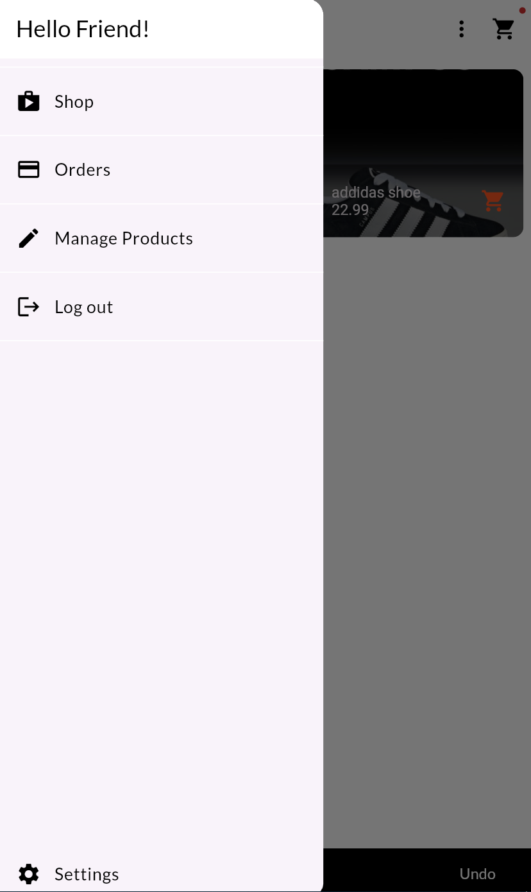
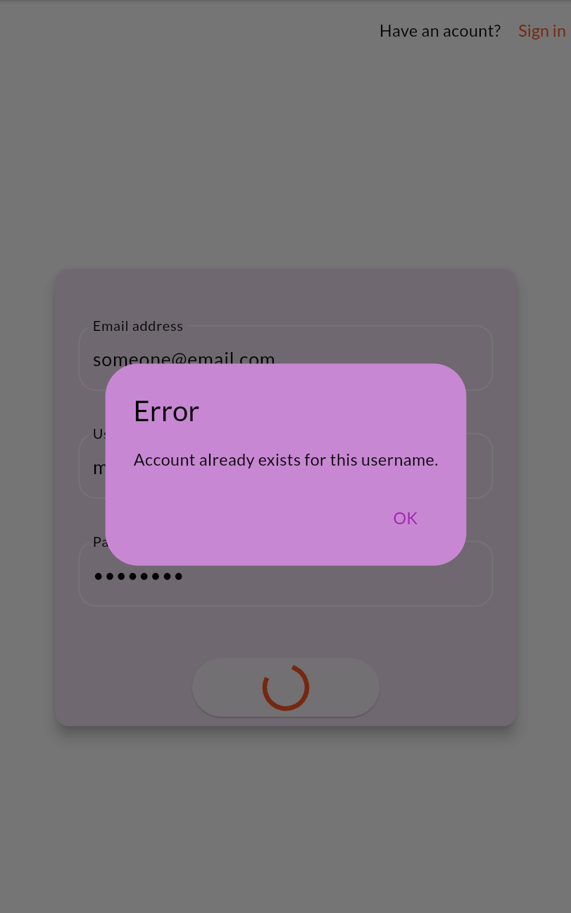
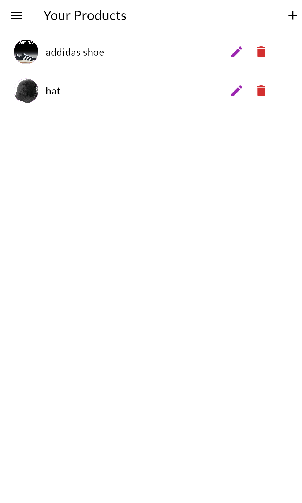
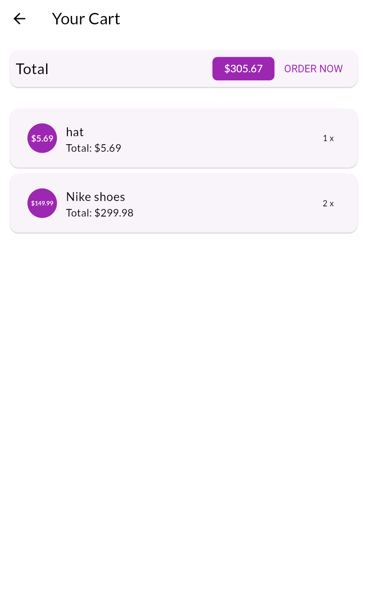

# ShopApp
A shop application with Flutter, using Provider as state management and parse-server back4app as backend.

&nbsp;

## Home screen
You can explore, like and purchase products on home screen

&nbsp;

## Login screen
When restarting app, you will automatically loged in by access token saved on your device

&nbsp;

## Add/Edit products screen
All users are available to Add or edit their own products

&nbsp;

## Order screen
After you added products to your cart, then you can see, edit and purchase them here

&nbsp;

